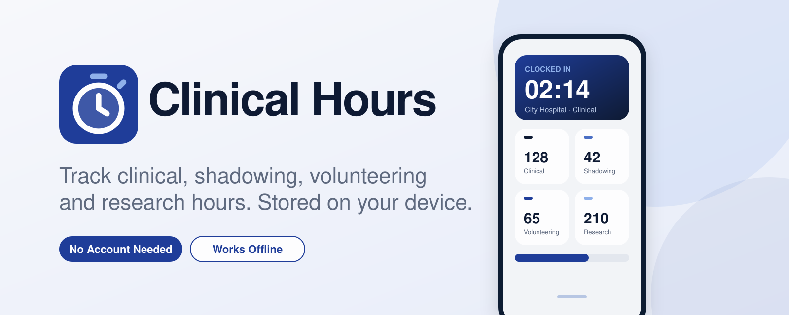

<p align="center">
  
</p>

<h1 align="center">Clinical Hours</h1>

<p align="center"><em>Log your clinical, shadowing, volunteering and research hours, and organize them for your applications.</em></p>

<p align="center">
  <a href="https://bicklabs.github.io/hours-tracker/"></a>
  
  
  
  
</p>

> **Independent project.** This is an independent organizational tool. It is not affiliated with, endorsed by, or sponsored by the Association of American Medical Colleges (AAMC), AMCAS, CASPA, or any medical school or PA program. See [Disclaimer](#disclaimer).

## What You Can Do

| | | |
|---|---|---|
| **Clock In and Out**<br>One tap to start a shift. Add a note and Highlight the moments worth writing about. | **Log Past Shifts**<br>Forgot to clock in? Add it later, or repeat a recent shift in one tap. Overlaps get flagged. | **Search Your History**<br>Find any note or location. Filter by category, location or Highlights, and undo a delete. |
| **Application Reports** `Beta`<br>An Application Packet and an Hours Summary, saved as PDFs. Choose a Pre-Med or Pre-PA layout modeled on the AMCAS and CASPA experience sections. | **Import Your Old Hours** `Beta`<br>Bring in an Excel or CSV file, or paste rows from Google Sheets. Every import can be undone. | **Export and Back Up**<br>CSV for Excel, plus one backup file with everything. Restore it on a new phone. |
| **Your Own Categories**<br>Add, rename, recolor or hide categories. Set an hour goal and watch the gauge fill. | **Six Color Themes**<br>Blue, Rose, Blossom, Lavender, Sage and Sunset, each with a dark version. | **Stored on Your Device**<br>No account. The app has no analytics and doesn't send your entries anywhere. See [Data and Privacy](#data-and-privacy). |

### Screenshots

The banner above is an illustration, not a screenshot. Screenshots of the app have not been added yet.

## Get It on Your Phone

Add the app to your Home Screen **before you log any hours.** The Home Screen app keeps its own data, separate from the browser's copy, so hours logged in one won't appear in the other. Always log from the same one.

### iPhone

1. Open [the app](https://bicklabs.github.io/hours-tracker/) in **Safari**. Other browsers, and the browser inside Instagram or Messages, don't offer Add to Home Screen.
2. Tap the **Share** button, the square with an arrow pointing up. On newer versions of iOS it may be under the **•••** button at the bottom right.
3. Scroll down and tap **Add to Home Screen**.
4. Leave **Open as Web App** on and tap **Add**.
5. Open **Hours** from your Home Screen. From now on, log from there.

### Android

1. Open [the app](https://bicklabs.github.io/hours-tracker/) in **Chrome**.
2. Tap **Install App** on the card at the top of the app, or open the **⋮** menu and tap **Install app** (some phones say **Add to Home screen**).
3. Tap **Install**, then open **Hours** from your Home Screen.

### If Something Looks Wrong

- **No Add to Home Screen option on iPhone:** you're not in Safari. Copy the link and open it there.
- **Your hours disappeared after adding it:** the Home Screen app and the browser keep separate data. In the browser, go to **Reports › Backup › Back Up Now**. Then in the Home Screen app, use **Restore**.
- **Two Hours icons:** delete the extra one only after you've backed up. Deleting an app from the Home Screen erases its data.

## Features in Detail

Status labels come from checking each feature in the code. Features marked **Beta** are also tagged Beta inside the app.

| Feature | Status |
|---|---|
| Clock in and out, with an optional note and Highlight at clock-out | Implemented |
| A "Still clocked in?" prompt after 24 hours, with a way to enter when you actually left | Implemented |
| Add a past shift, repeat a recent shift, overlap warnings | Implemented |
| Edit and delete entries, with Undo after a delete | Implemented |
| History with search, category, location and Highlights filters | Implemented |
| Calendar with hours shown per day, days colored by the category with the most hours, and a monthly summary | Implemented |
| Categories: add, rename, choose an icon and color, set an optional hour goal, hide or show. Default categories are Clinical, Shadowing, Volunteering and Research | Implemented |
| Contact details for each location (name, title, email, phone, city, description). The app calls these "contact" details | Implemented |
| Color themes (six) and Light, Dark or Match Phone appearance | Implemented |
| Export CSV and Copy Rows for Excel | Implemented |
| Backup and restore (Merge or Replace) | Implemented |
| Install as an app and use offline after the first load | Implemented |
| Mobile-first layout (checked at phone width) | Implemented. Other screen sizes have not been formally tested |
| Reports: Application Packet, Hours Summary and saved report snapshots | **Beta** |
| Pre-Health Track: General, Pre-Med or Pre-PA | **Beta** |
| Import Hours from .xlsx, CSV or pasted rows, with Past Imports and Undo | **Beta** |

Not implemented: user accounts, cloud sync, backup encryption, notifications, and any way to submit an application to an application service.

### Clock
Clock in and out with an optional note and Highlight at clock-out. It asks "Still clocked in?" after 24 hours and shows a monthly backup reminder.

### Add
Log a past shift, or repeat a recent one in one tap. Overlapping shifts get a warning.

### History
Search notes and locations, filter by category, location or Highlights, and undo a delete.

### Reports
- **Summary:** totals by year, where you choose the months a year covers. It also holds contact details for each location, the Application Packet and Hours Summary PDFs (`Beta`), and saved report snapshots.
- **Export:** CSV and copy-to-Excel.
- **Backup:** save and restore everything, and import hours from a spreadsheet (`Beta`).

## Data and Privacy

This section describes what the code does, based on a review of the repository. It is not a legal privacy policy.

- **No account is needed.** There is no sign-in, and the app has no server of its own.
- **Where your data is stored:** in your browser's `localStorage` on your device, under keys that start with `cht.`. It is stored as plain, unencrypted text.
- **What is stored:** your entries (date, times, category, location, notes, Highlights), your categories, saved locations and their contact details (names, titles, emails, phone numbers, city, description), saved reports, import history, and settings such as your color theme and Pre-Health Track. Contact details and notes can be personal, so treat your device and your backup files accordingly.
- **What the app sends:** in the code and in a test session, the app made requests only to the site it was loaded from, to download its own files (page, styles, scripts and font). Nothing in the code sends your entries, notes, locations or contact details to any other service. There are no analytics, tracking, advertising, error-reporting or login services in the code.
- **What the app can't control:** the sites that host the app (GitHub Pages for the stable version, Cloudflare for the beta) can see normal web request information such as your IP address when your phone downloads the app files. Their own privacy statements apply. Your browser, operating system, extensions and phone backups (for example iCloud or Google backup) are outside this app's control and may handle your device's stored data.
- **Files you choose to share:** Export CSV, Copy Rows, Back Up, and saving a report as a PDF all put data into a file, the clipboard or your phone's share sheet. From there it goes wherever you send it, such as Files, AirDrop, email or a cloud drive.
- **A Content Security Policy** in `index.html` tells the browser to load the app's scripts, fonts and images only from its own site, and to allow connections only to it. This is a protective layer, not a guarantee.
- **Import and reports run on your device.** Spreadsheets you import are read by the app in your browser and are not uploaded.
- **Erase All Data** (Settings) removes the entries, locations, reports, imports and settings the app saved on that device.

How this was checked, and its limits, are in [PROJECT-AUDIT.md](PROJECT-AUDIT.md). A code review can't rule out everything: a future version of the code, your browser, or the hosting service could behave differently from what is described here.

## Backup and Recovery

- **How:** Reports › Backup › **Back Up Now** creates one file named `clinical-hours-backup_<date>_<time>.json`. On a phone it opens the share sheet so you can save it to Files. Use **Restore** to load it, then choose **Merge** (adds what's missing) or **Replace All** (erases what's on the device and uses only the backup).
- **What it contains:** entries with notes and Highlights, categories and goals, saved locations and their contact details, saved reports, past imports, and your settings, including theme and Pre-Health Track.
- **It is not encrypted.** The backup is a plain text JSON file. It includes notes and contact details, so store and send it carefully.
- **It stays on your device** until you move it. The app never uploads it. Anything you do with the file afterward (email, cloud drive) is up to you.
- **Compatibility:** a backup is a plain file, so it restores in any browser or device that runs the app. Backups from older versions still restore; they just don't include newer features. A backup made in the beta may include newer data than an older app understands.
- **Bad files:** a file that isn't a valid backup shows a message and changes nothing. Individual unreadable entries are skipped and counted.

What can lose your hours:

| Situation | What happens |
|---|---|
| You clear the browser's site data, or erase the app's storage | Your hours are deleted. Restore from a backup |
| You delete the app from your Home Screen | Its data is deleted. Restore from a backup |
| You switch browsers, or use the browser copy instead of the Home Screen copy | Each keeps its own separate data. Move it with a backup |
| You get a new phone | Nothing moves automatically. Back up on the old phone and restore on the new one |
| Your phone is lost or broken | Without a backup file saved elsewhere, the hours can't be recovered |
| Browser storage is damaged | The app falls back to empty for what it can't read, and later saving can overwrite the damaged data. Keep recent backups |
| Your browser removes stored data on its own | This can happen on some browsers, for example after a long time without use. The app asks the browser to keep its data, but that is a request, not a guarantee. Back up monthly |

Back up regularly, and keep a copy somewhere other than your phone.

## Application Reports

Under Reports › Summary › **Create a Report** (`Beta`) the app makes two kinds of report. Each opens as a page you can save as a PDF, then keep in Files, AirDrop or email to your laptop. Each report keeps a snapshot of your hours on the day you made it.

- **Application Packet:** every location's details, dates, hours and Highlights in one file.
- **Hours Summary:** a one-page overview by category and location.

**Pre-Health Track** (`Beta`, in Settings) changes how the Application Packet is laid out:
- **General:** a simple packet listing every location.
- **Pre-Med:** numbered entries, oldest first, with fields and a description count modeled on the AMCAS Work and Activities section.
- **Pre-PA:** experiences grouped by category with totals and average hours per week, modeled on the CASPA experience sections.

These layouts are organizational aids. They are **not official AMCAS or CASPA formats**, they can't be uploaded or submitted to an application service, and they haven't been checked against the services' current instructions. Application requirements change, so always read the current instructions and enter your experiences in the application yourself. You are responsible for the accuracy of what you submit.

## Importing Hours `Beta`
Reports › Backup › **Import Hours** brings in hours tracked somewhere else. Everything is read on the phone; nothing is uploaded.
- **Sources:** an Excel (.xlsx) or CSV file, or rows copied from Excel or Google Sheets and pasted in. Numbers and old .xls files need to be saved as .xlsx or CSV first.
- **Step 1, Sheets:** each sheet is matched to a category by its name. Unmatched sheets can be assigned, skipped, or given a new category.
- **Step 2, Columns:** Date, Location, Time Begin, Time End, Hours and Notes are matched automatically, with dropdowns to fix any wrong guess. Dates like 8/16/25, 2025-08-16 and Aug 16 2025, times like 7:00 PM, 0700 and 19:00, and hours like 4.5 or 4:30 all work. Overnight shifts are handled. Rows with hours but no times are saved as "Times not recorded".
- **Step 3, Review:** shows the total before anything is saved. Rows already in the app are skipped, overlapping shifts can be imported or left out, near-duplicate location names can be combined, and rows that couldn't be read are listed with the reason.
- **Undo:** every import can be undone later from **Past Imports**. Undo removes only that import's entries.
- **Template:** Download a Template gives a blank CSV with the columns the app reads. The app's own CSV export can also be imported.

## Settings
Tap **Settings** on the Clock screen for:
- **Quick Guide:** where to find every feature.
- **Categories:** switch a category off to hide it everywhere. Its hours are kept and come back when you switch it on. Tap the pencil to rename it or change its icon, color and optional hour goal. Tap **Add Category** to create a new one. A category can only be deleted while it has no entries.
- **Pre-Health Track** `Beta`: General, Pre-Med or Pre-PA. It sets the layout of the Application Packet (see [Application Reports](#application-reports)).
- **Color Theme:** Blue, Rose, Blossom (pastel pink), Lavender, Sage or Sunset, each with six shades of one color for categories.
- **Appearance:** Light, Dark or Match Phone. Every theme has a dark version.
- **Privacy:** how data is stored, plus Erase All Data.
- The version number is shown at the bottom.

The code has no locations built in. Each person adds their own, and they're saved on the device and in backups. To load a list you already have, use **Restore** → **Merge** with a backup file that contains them.

## Running and Deploying It

There is no build step and no package manager. The app is plain HTML, CSS and JavaScript.

### Files
- `index.html`, `styles.css`, `app.js`, `importer.js`: the app. `importer.js` reads spreadsheets.
- `theme.js`: applies the saved color theme before the page draws
- `manifest.webmanifest`, `sw.js`, `icons/`: install and offline support
- `assets/`: the README banner illustration
- `fonts/`: the Geist font (SIL Open Font License, see `fonts/OFL.txt`), bundled so the app loads no outside font
- `THIRD-PARTY-NOTICES.md`, `SECURITY.md`, `PROJECT-AUDIT.md`: notices, security notes and the audit report

### Run It Locally
Service workers need HTTPS or `localhost`. From the project folder:
```bash
python3 -m http.server 8765
```
Then open http://localhost:8765.

### Hosting
Upload the folder to any static host that serves over HTTPS, such as GitHub Pages, Netlify or Cloudflare. This repository is currently deployed with GitHub Pages (stable) and Cloudflare (beta).

### Updating the App
After you change any file, bump `CACHE` in `sw.js` (for example `clinical-hours-v10`) and upload the changed files. The next time the app is opened, it downloads the new version and shows a **"New version ready · Tap to update"** banner. If you skip the version bump, phones keep running the old copy. A shift in progress is stored on the device and isn't affected by an update.

### Testing Changes Before Everyone Gets Them
The repo has two branches:
- **`main`** is the stable app. It is served by GitHub Pages at `bicklabs.github.io/hours-tracker`.
- **`dev`** is where new and beta features go first. It is served by Cloudflare at its own, unlisted address.

A phone keeps saved data per web address, so the two copies never share or damage each other's hours. Build and test on `dev`. When a change is ready, merge `dev` into `main`. Beta features carry a **Beta** tag in the app until they are finished.

## AI-Assisted Development

This project was developed with substantial assistance from Anthropic's Claude, an AI model. Claude was used for code generation, debugging, refactoring, implementation help and iterating on the design and documentation, including this README.

The project author is responsible for the product concept, feature requirements, product direction and design decisions, and for testing, reviewing generated code, choosing and modifying implementations, managing the repository, writing and reviewing documentation, and maintaining the project. Claude does not own, operate or maintain the project.

Parts of the code were AI-generated and parts were modified by the author, and this document doesn't attempt to say which is which. It also makes no claim about who owns the copyright in AI-assisted work, which is a legal question. See [License](#license).

## Third-Party Software

The app has no runtime dependencies, no package manager and no build step. The only bundled third-party material is the **Geist** font, licensed under the SIL Open Font License 1.1. Its license text is in `fonts/OFL.txt`, and attribution details are in [THIRD-PARTY-NOTICES.md](THIRD-PARTY-NOTICES.md). The README's status badges are images loaded from shields.io when you view this page on GitHub. The app does not load them.

## Disclaimer

Clinical Hours is an organizational tool. It is not affiliated with, endorsed by, or sponsored by the Association of American Medical Colleges (AAMC), AMCAS, CASPA, or any medical school or PA program. "AMCAS," "AAMC" and "CASPA" are names used only to describe the kind of application the report layouts are modeled on. They belong to their respective owners.

You are responsible for checking that your hours, dates, locations, contact details and descriptions are accurate, and for entering them correctly in any application. The app can contain bugs, and its reports and totals are not official records. The software is provided as is, without warranty. Keep your own records, and back them up.

## License

**This repository does not currently have a license.** Until one is added, no permission to copy, modify or redistribute the code has been granted. GitHub's Terms of Service separately allow viewing and forking public repositories on GitHub. Using the hosted app is not affected. A license will be added as a `LICENSE` file once one is chosen, and that file will describe what is permitted. This is a description of the repository's current state, not legal advice.

## Contributing

No contribution guidelines have been established yet.

## Issues and Bug Reports

Report problems or suggestions on [GitHub Issues](https://github.com/bicklabs/hours-tracker/issues). Please don't include personal information, such as real names, contact details or backup files, in an issue. For security problems, see [SECURITY.md](SECURITY.md).

## Roadmap

No roadmap has been published. Reports, Import Hours and Pre-Health Track are marked Beta because they are still being refined.
